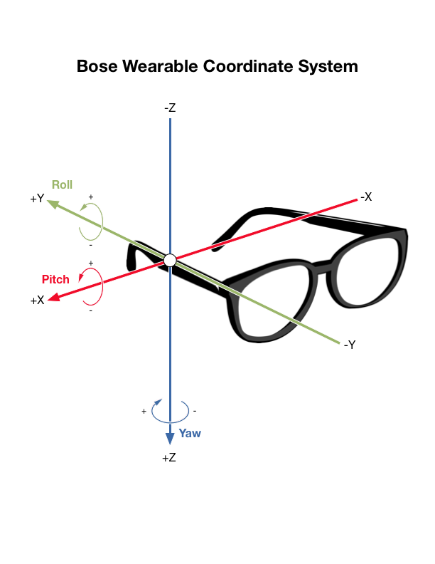

# Sensors and Coordinate System

This document explains the device's coordinate system, the sensors supported by the BoseWearable SDK, and their units.

## Coordinate System

The following image shows the coordinate system used by Bose Wearable devices.



The **X axis** is positive toward the user's right and negative toward the user's left.

The **Y axis** is positive toward the user's back and negative toward the user's front.

The **Z axis** is positive toward the user's body and negative toward the top of the user's head.

**Pitch** is rotation around the X axis. Positive pitch corresponds to looking up. Negative pitch corresponds to looking down.

**Roll** is rotation around the Y axis. Positive roll corresponds to tilting the head towards the left shoulder. Negative roll corresponds to tilting the head towards the right shoulder.

**Yaw** is rotation around the Z axis. Positive yaw corresponds to turning the head to the right. Negative yaw corresponds to turning the head to the left.

## Sensors

This section describes the four sensors that are exposed by the Bose Wearable SDK: Accelerometer, Gyroscope, Rotation Vector, and Game Rotation Vector.

### Accelerometer

- Measures acceleration minus the force of gravity
- Provides 3-dimensional vector values
- Unit: g = 9.81 ms<sup>-2</sup>

#### Example

If the device lying flat on a table, the accelerometer reading would be approximately (0, 0, -1). This is the acceleration of the device minus the force of gravity along the Z-axis: (0, 0, 0) - (0, 0, 1) = (0, 0, -1).

### Gyroscope

- Measures the rate of rotation around the three sensor axes
- Provides 3-dimensional vector values
- Unit: Degrees per second

#### Example

If the user's head is still, the accelerometer reading would be approximately (0, 0, 0).

Nodding the head up and down corresponds to rotation around the X axis. Thus, moving the head up corresponds to a positive X value in the gyroscope reading. Moving the head down corresponds to a negative X value in the gyroscope reading.

Tilting the head (i.e., moving the ear towards the shoulder) corresponds to rotation around the Y axis. Thus, tilting the head to the left corresponds to a positive Y value in the gyroscope reading. Tilting the head to the right corresponds to a negative Y value in the gyroscope reading.

Shaking the head left and right corresponds to rotation around the Z axis. Thus, turning the head to the right corresponds to a positive Z value in the gyroscope reading. Turning the head to the left corresponds to a negative Z value in the gyroscope reading.

### Rotation

- Measures the orientation of the device relative to magnetic north
- Uses the accelerometer, gyroscope, and magnetometer to derive the orientation value
- Provides 4-dimension quaternion values
- Quaternions emitted by the SDK are unit quaternions with a norm of 1
- Unitless

The quaternion values emitted by the SDK provide pitch, roll, and yaw properties that automatically convert from quaternions to Euler angles. Euler angle values are in radians.

### Game Rotation

- Similar to the rotation vector but does not use the geomagnetic field
- Not relative to magnetic north but to some other reference
- Provides 4-dimension quaternion values
- Quaternions emitted by the SDK are unit quaternions with a norm of 1
- Unitless

The quaternion values emitted by the SDK provide pitch, roll, and yaw properties that automatically convert from quaternions to Euler angles. Euler angle values are in radians.

### Euler Angle Derivation from Quaternions

The `Quaternion` type in the SDK provides deprecated `pitch()`, `roll()`, and `yaw()` methods. These return the right-handed rotation around the X, Y, and Z axis, respectively, as defined in the Bose Wearable Coordinate System. However, these only work for the raw Quaternion coming from the device. If calibrating or mapping to a different coordinate system, derive your pitch, roll, and yaw in the new coordinate system from right-handed `Quaternion.xRotation()`, `Quaternion.yRotation()`, and `Quaternion.zRotation()`.

For example:

```java
static final Quaternion TRANSLATION_Q = new Quaternion(1, 0, 0, 0);

Quaternion quaternion = Quaternion.multiply(sensorValue.quaternion(), TRANSLATION_Q);

double pitch = quaternion.xRotation();
double roll = quaternion.yRotation();
double yaw = -quaternion.zRotation();
```

## User Heading

The rotation sensor can be used to determine the user's heading. The `yaw()` method on the `Quaternion` values emitted by the rotation sensor indicate the user's heading relative to magnetic north (i.e., the magnetic north pole). This value is in radians. Note that the `quaternionAccuracy()` reading should be taken into consideration when interpreting this value.

Android SDK contains a [android.hardware.GeomagneticField](https://developer.android.com/reference/android/hardware/GeomagneticField) class that uses the World Magnetic Model and provides estimates magnetic field at a given point on Earth, and in particular, to compute the magnetic declination from true north. 

## Other sensors

Other sensor types (orientation, magnetometer, and uncalibrated magnetometer) are supported by the SDK but are not enabled by the device firmware. They are included in the SDK for internal testing purposes.

Orientation values can be derived by the pitch, roll, and yaw properties of the quaternion values emitted by the rotation and game rotation sensors.

The SDK does not provide direct access to the magnetometer as that data is not useful in isolation. The hardware fuses the raw magnetometer data with the other sensors to derive the rotation vector which is relative to magnetic north. The compass heading is accessible via the yaw property of a quaternion value provided by the rotation sensor.
